# Blazor Serverアプリでの認証・認可

## テナントの作成

省略

## アプリの作成

Visual Studio 2022 でプロジェクトを新規作成すると AzureAD のアプリ登録までしてくれるようになってました。
* 新しいプロジェクトの追加

    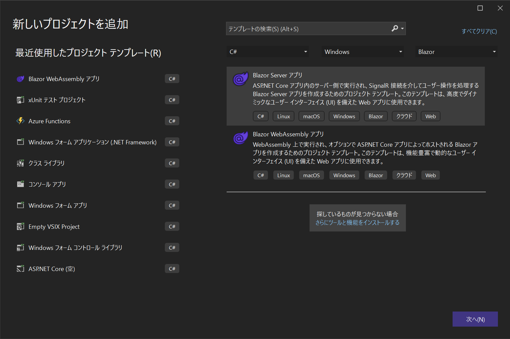

    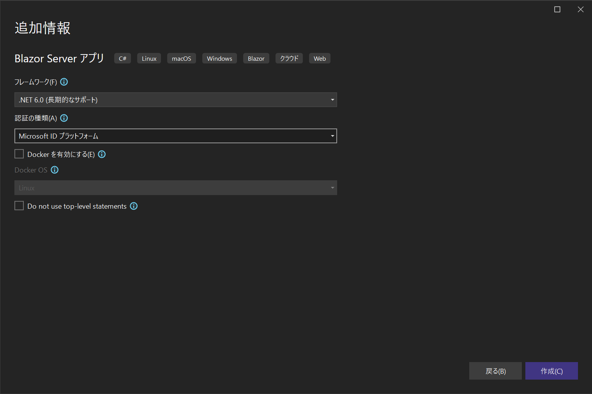

    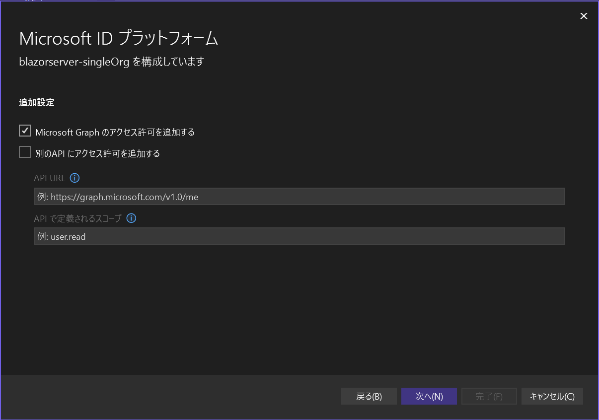

    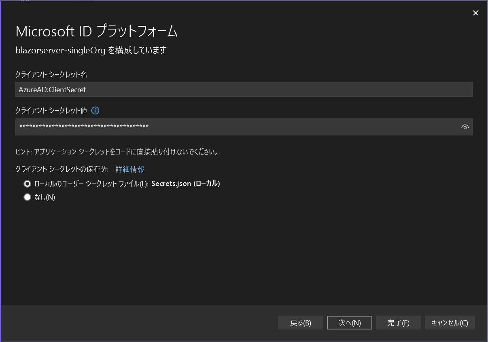

    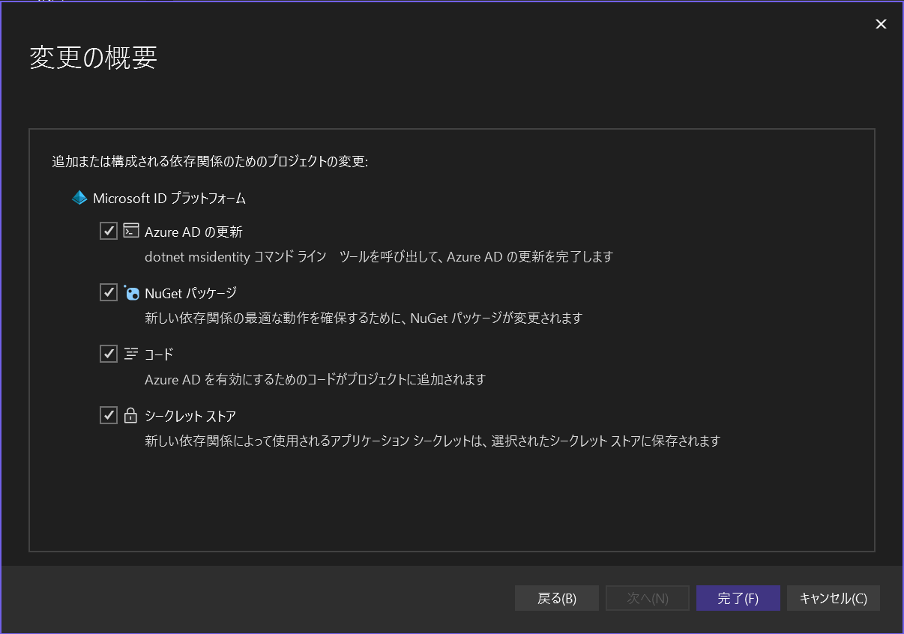

* 作成後

    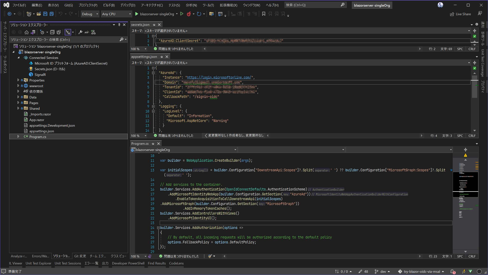

* nuget パッケージ参照

    以下の nuget パッケージ参照が追加されてます。
    * Microsoft.AspNetCore.Authentication.JwtBearer
    * Microsoft.AspNetCore.Authentication.OpenIdConnect
    * Microsoft.Identity.Web
    * Microsoft.Identity.Web.MicrosoftGraph
    * Microsoft.Identity.Web.UI

## アプリ登録内容の確認

Azure portal で [Azure Active Directory] に移動し登録内容を確認します。

* 概要

    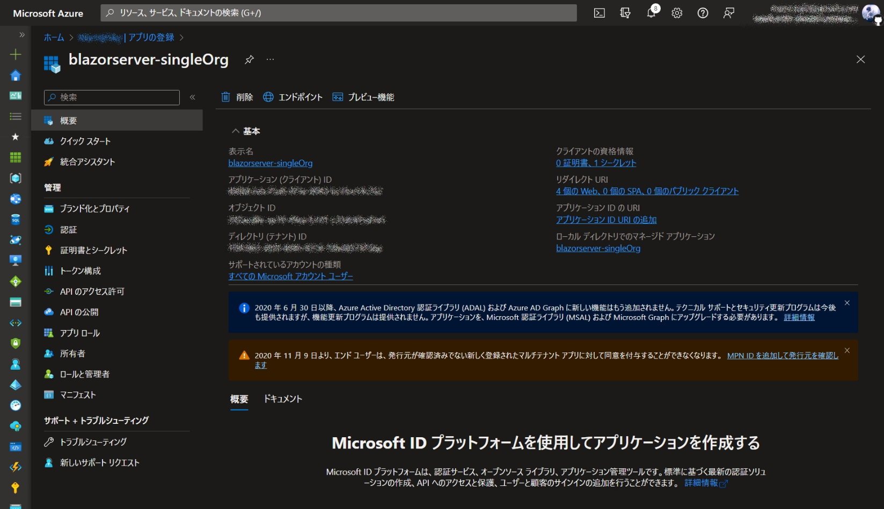

* 認証

    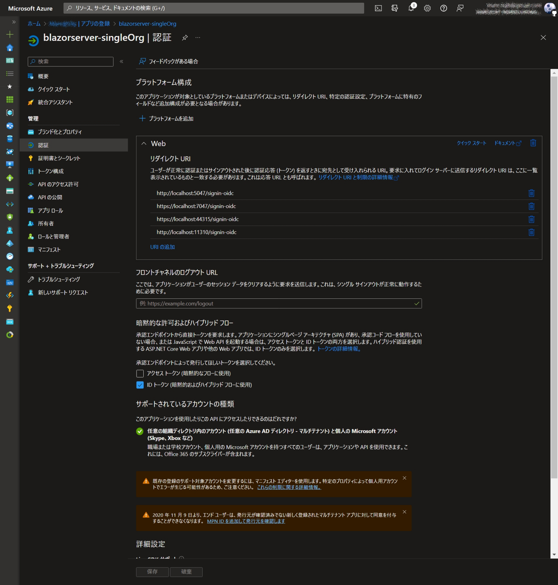

* 証明書とシークレット

    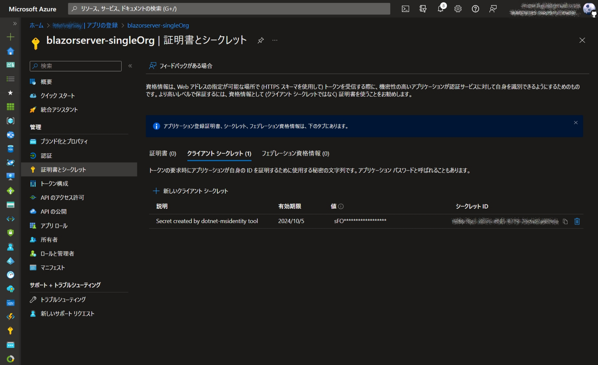

* APIのアクセス許可

    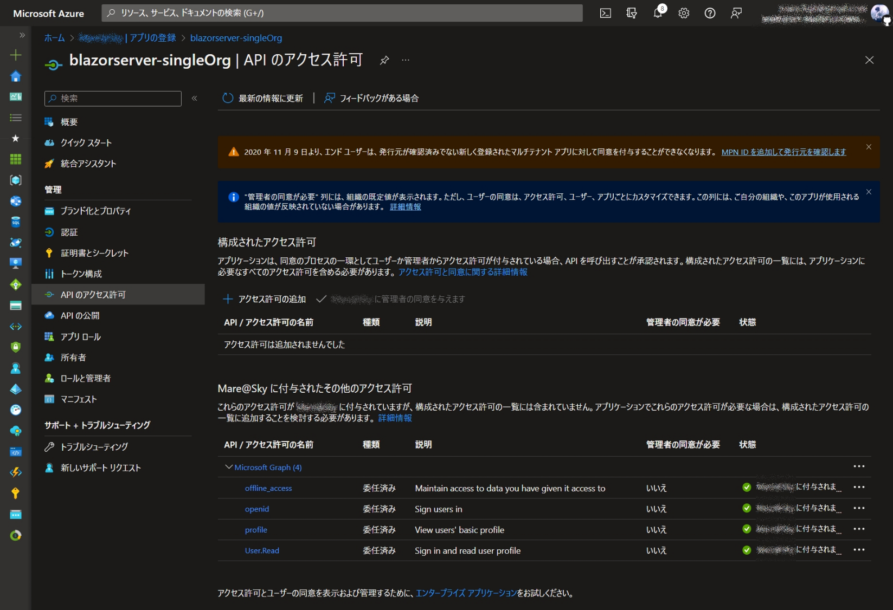

* 初回のログイン時

    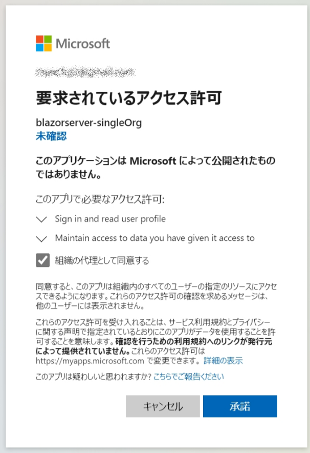

## アプリの変更

### ログイン必須とするようにアプリを変更
既定でログイン必須となっているみたいなので変更不要です。

### ログインモードの変更
既定でリダイレクトの動作となっているので変更不要です。
