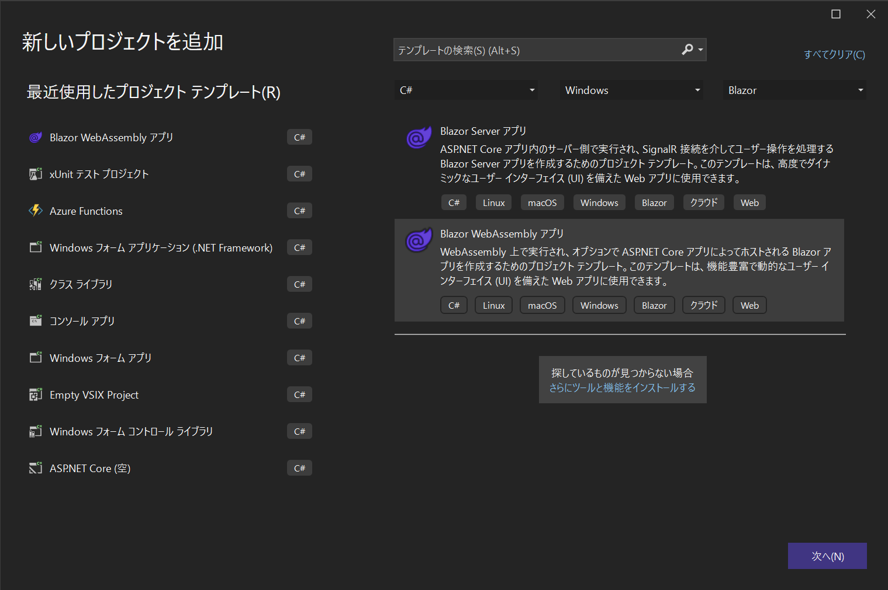
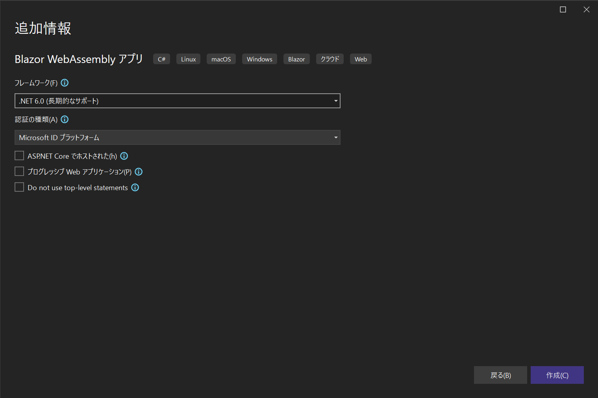
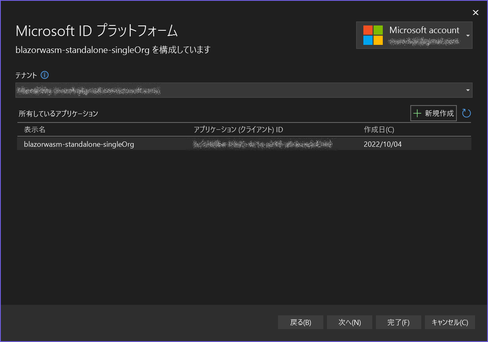
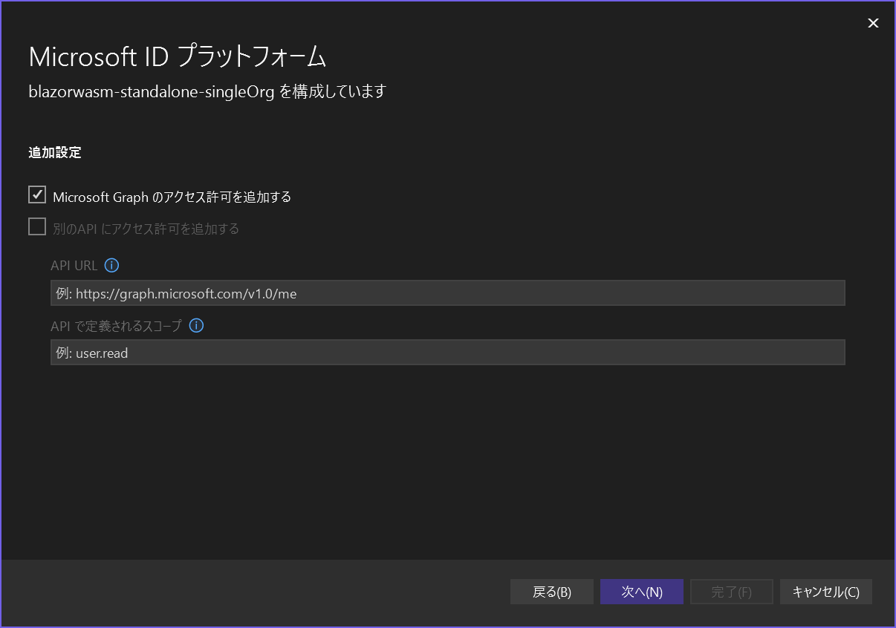
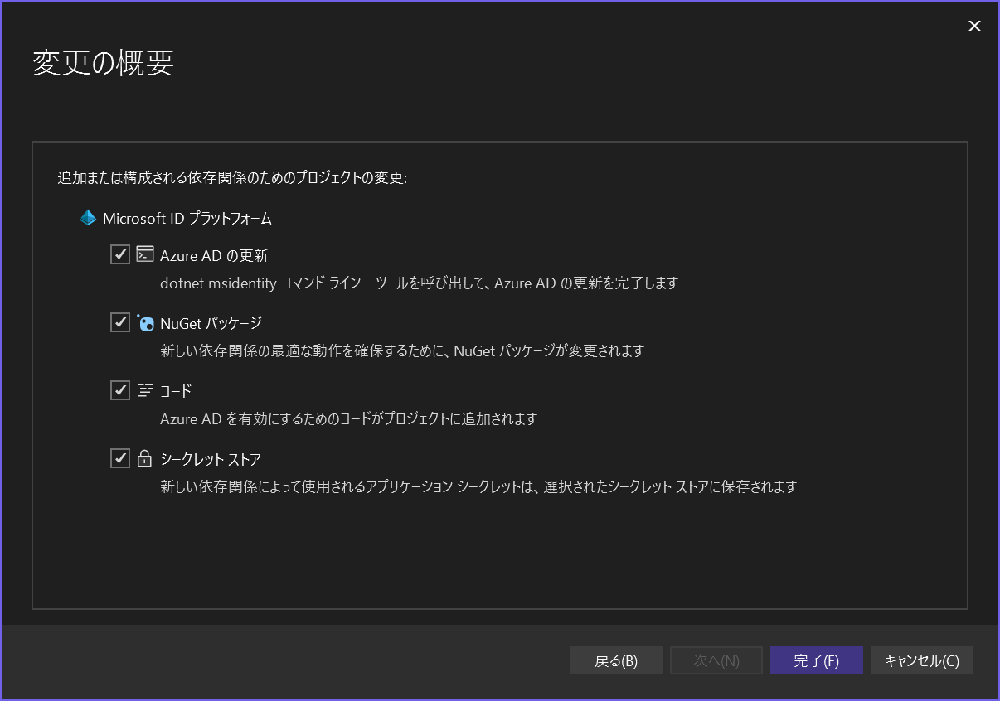
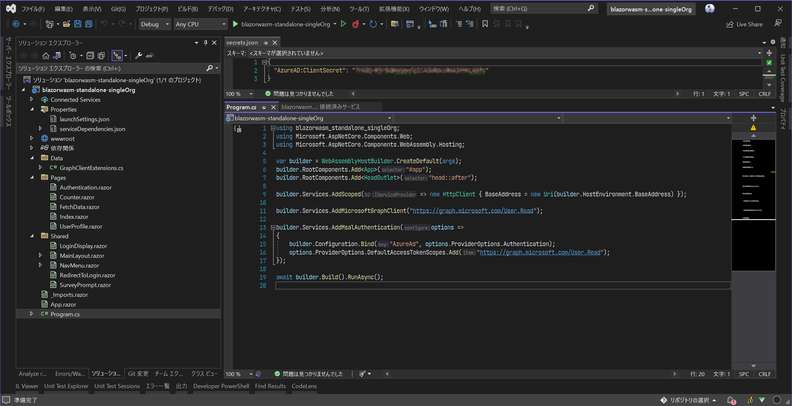
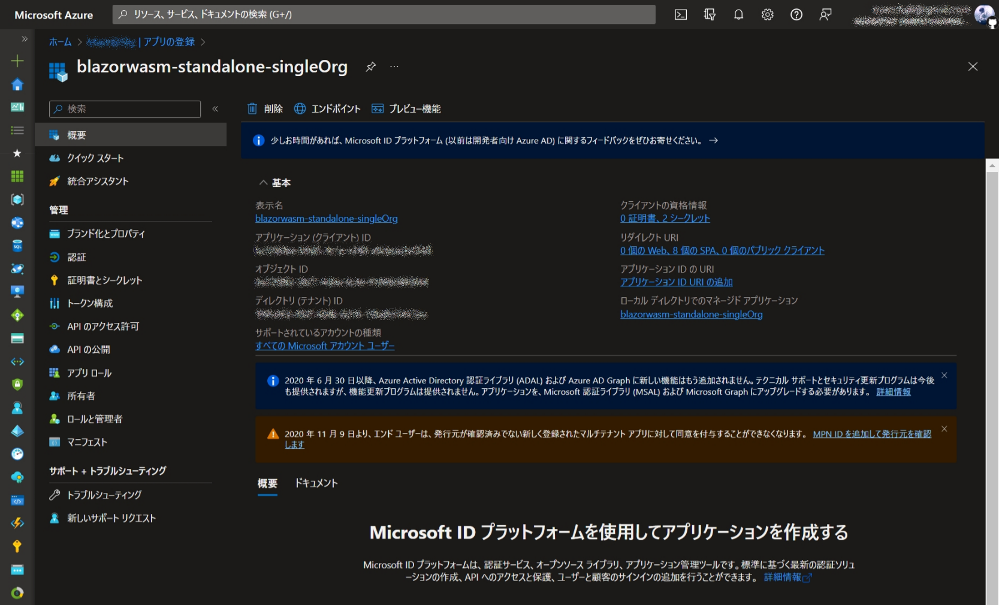
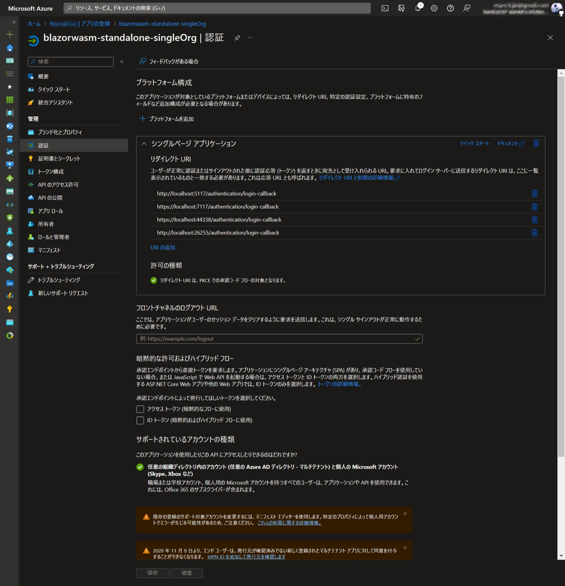
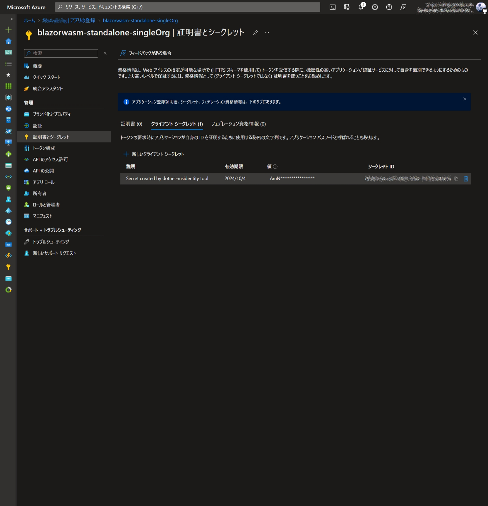

# Blazor WebAssembly(Standalone)アプリでの認証・認可

## テナントの作成

省略

## アプリの作成

Visual Studio 2022 でプロジェクトを新規作成すると AzureAD のアプリ登録までしてくれるようになってました。
* 新しいプロジェクトの追加

    

    

    

    

    

    

* 作成後

    

* nuget パッケージ参照

    以下の nuget パッケージ参照が追加されてます。
    * Microsoft.AspNetCore.Components.WebAssembly
    * Microsoft.AspNetCore.Components.WebAssembly.DevServer
    * Microsoft.Authentication.WebAssembly.Msal
    * Microsoft.Graph

## アプリ登録内容の確認

Azure portal で [Azure Active Directory] に移動し登録内容を確認します。

* 概要

    

* 認証

    

* 証明書とシークレット

    

## アプリの変更

### ログイン必須とするようにアプリを変更
すべてのページで認証が必要となるように `Authorize` を付与します。

ただし `Authentication.razor` では匿名アクセスできるように `AllowAnonymous` を付与します。

* \_Imports.razor
    ```razor
    @* ⬇️ 以下を追加 *@
    @using Microsoft.AspNetCore.Authorization
    @attribute [Authorize]
    ```

* \Pages\Authentication.razor
    ```razor
    @* ⬇️ 以下を追加 *@
    @using Microsoft.AspNetCore.Authorization
    @attribute [AllowAnonymous]
    ```

### 未ログイン時の表示内容を変更
未ログイン時に諸々を表示しないように変更します。

* \Shared\MainLayout.razor
    ```razor
    <AuthorizeView>
        <Authorized>
            @* ⬇️ 認証時の表示内容 *@
            <div class="page">
                <div class="sidebar">
                    <NavMenu />
                </div>

                <main>
                    <div class="top-row px-4 auth">
                        <LoginDisplay />
                        <a href="https://docs.microsoft.com/aspnet/" target="_blank">About</a>
                    </div>

                    <article class="content px-4">
                        @Body
                    </article>
                </main>
            </div>
        </Authorized>

        <NotAuthorized>
            @* ⬇️ 未認証時の表示内容 *@
            <div>
                @Body
            </div>
        </NotAuthorized>
    </AuthorizeView>
    ```

### ログインモードの変更
ログインモードをポップアップからリダイレクトに変更します。
* \Program.cs
    ```cs
    builder.Services.AddMsalAuthentication(options =>
    {
        // ...
        options.ProviderOptions.LoginMode = "redirect"; // ⬅️ 既定は "popup"
    });
    ```
